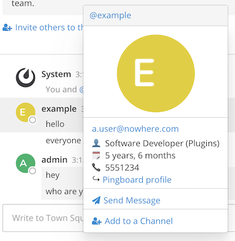

# Mattermost Pingboard Plugin

This plugin collects information on users from Pingboard and displays
it on the user popover card.

## Features

If data is found for the user, the user's popover card is extended with:
* Job title and department, with hyperlink to user's Pingboard profile
* Start date and phone number



## Pre-requisites

The plugin matches users based on (lower-case) email address, so this must match
in Pingboard and Mattermost.

Create a client ID for Pingboard with read-only access to user data
and note the client ID and client secret.

**Note**: information is collected for every Pingboard user accessible to the
client (even if they do not have a Mattermost account) and could be seen by authenticated
Mattermost users via the plugin's http endpoint. Before using this plugin
you should be comfortable with the users' data being visible in this way.

## Configuration

Configuration in `config.json` is as follows:
```json
        "Plugins": {
            "com.imc.mattermost-plugin-pingboard": {
                "pingboardApiId": "...",
                "pingboardApiSecret": "..."
            }
        },
```

## Implementation notes

The server plugin collects information on the Pingboard client's company
(to get the right sub-domain for the user's profile URL),
and all users visible to the client, as well as the name of any group listed as the first department
for each user. This is held in memory, indexed by user email address.
It will attempt to fetch this information every 6 hours.
The information for a user can then be accessed as JSON via the plugin's http endpoint
by querying for their email address.

The client plugin looks up the user's information via the server plugin's http endpoint every time
the popover card is opened.
