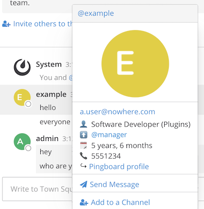

# Mattermost Pingboard Plugin

This plugin collects information on users from Pingboard and displays
it on the user popover card.

## Features

If data is found for the user, the user's popover card is extended with:
* Job title and department
* Years/months since start date
* Phone number
* @-mention for manager (if manager was also found as a mattermost user)
* Link to user's Pingboard profile



## Pre-requisites

The plugin matches users based on email address, so this must match
in Pingboard and Mattermost. The email addresses are first normalised
by stripping out all characters except letters, digits and dots, and
then compared as lowercase - so `a-Strange.Email+address@somewhere.com`
will match `astrange.emailaddress@somewhere.com`.

Create a client ID for Pingboard with read-only access to user data
and note the client ID and client secret.

**Note**: information for any Mattermost user

## Configuration

Configuration in `config.json` is as follows:
```json
{
        "Plugins": {
            "com.imc.mattermost-plugin-pingboard": {
                "pingboardApiId": "...",
                "pingboardApiSecret": "..."
            }
        }
}
```

## Implementation notes

* Pingboard is queried for company information (for inserting sub-domain into pingboard link URLs),
  and all known users. The first valid group listed under the user's departments is also looked up
  to get the department name.
* Pingboard users are then matched by email address against mattermost users. The email address
  match ignores all characters except letters, digits and dots, and compares in lowercase.
* The resulting data is held in memory in the server plugin and fetched again every 6 hours, or
  when a new user is created.
* The client looks up information for a user by username via the plugin's internal http endpoint.
  The information is retrieved from the server every time a popover is created.
